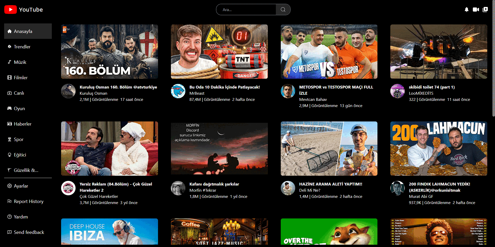

# YouTube Clone Project

This project is a YouTube clone developed using React and the YouTube API. It allows users to search for videos, view video details, and watch videos within the application.

## Features

- **Search**: Search for videos using the YouTube API.
- **Video Player**: Watch videos within the application using the React Player library.
- **Video Details**: View details about each video, including title, description, and upload date.
- **Responsive Design**: The application is fully responsive, ensuring a seamless experience across different devices.

## Libraries Used

- **Tailwind CSS**: A utility-first CSS framework used for styling.
- **React-icons**: Provides icons for the application's user interface.
- **React-router-dom**: Handles routing within the application.
- **React-player**: Integrates the YouTube video player into the application.
- **Millify**: Formats numbers, such as video views and likes, for better readability.
- **Moment**: Formats dates, such as video upload dates, for better readability.
- **Axios**: Handles HTTP requests to the YouTube API.

## Preview



## Deployment

The project is deployed and can be accessed [here](https://keen-frangipane-b484ce.netlify.app).

## Installation

To run the project locally, follow these steps:

1. Clone the repository:

```bash
git clone https://github.com/KamilErdogmus/Youtube-Clone.git
```

2. Navigate to the project directory:

```bash
cd your-repository
```

3. Install dependencies:

```bash
npm install
```

4. Start the development server:

```bash
npm start
```

5. Open your web browser and visit http://localhost:3000 to view the application.
